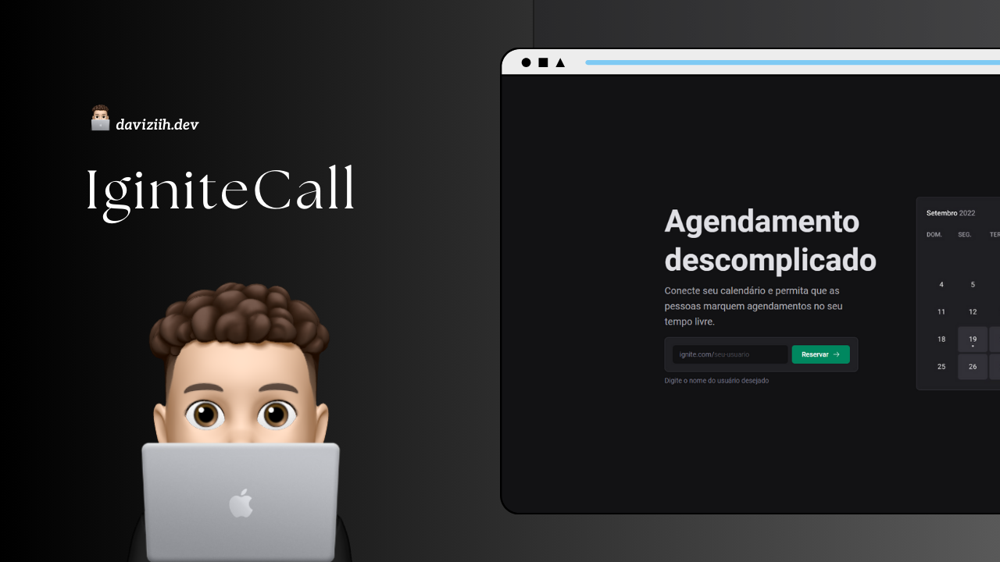

<h1 align="center">Ignite Call - Descomplique sua agenda<h1/>

  

## 🚀 Tecnologias

Esse projeto foi desenvolvido com as seguintes tecnologias:

- React
- OAuth
- Google Calendar
- Zod
- Prisma
- Nookies

## 💻 Projeto

ste projeto é uma aplicação web desenvolvida em Next.js que permite aos usuários agendar horários para conversar com você. Os agendamentos são integrados diretamente ao Google Calendar e geram chamadas no Google Meet, facilitando a organização de reuniões de forma prática e eficiente.
